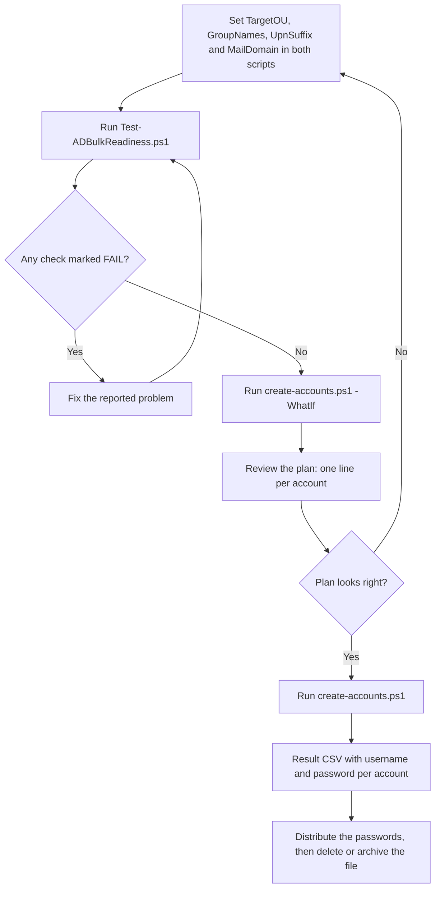
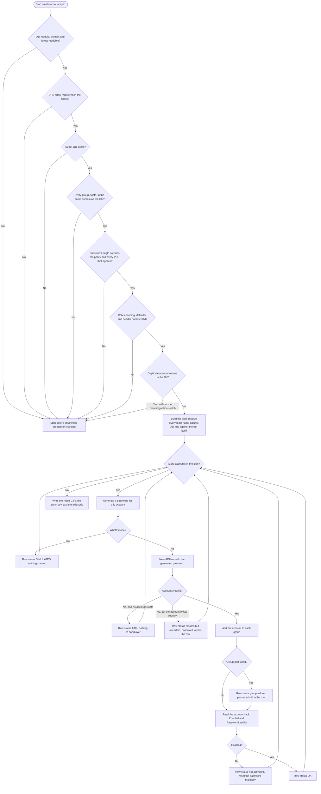

# AD bulk account toolkit

Two PowerShell scripts for creating Active Directory user accounts in bulk from a CSV export, plus a read-only readiness checker that tells you whether the run will work **before** it touches your directory.

No agent, no MCP server, no internet access, no dependencies beyond RSAT. Everything runs locally against your own domain.

- `Test-ADBulkReadiness.ps1` — read-only preflight. Checks the environment, the directory and the CSV, and reports every problem as OK, WARN or FAIL. Creates nothing, changes nothing, writes no files.
- `create-accounts.ps1` — the creator. Validates first, refuses to start if anything is wrong, creates the accounts, verifies each one, and writes a result file with usernames and passwords.

The workflow is: verify, simulate, review, then run.

## How it works

The operating flow, from filling in the parameters to handing out passwords:



Inside `create-accounts.ps1` every gate runs before the first write, so a failure
never leaves a half-finished run. Each account then ends in exactly one of five
states, and the password reaches the result file before the group step:



## Why a preflight script exists

`New-ADUser` has a behaviour that surprises people. If the password you supply is rejected by the domain password policy, **the account is still created** — it just never gets enabled. A script that ignores this produces a directory full of accounts nobody can log into, plus a result file that claims those accounts were created successfully with a password that was never set.

Two other failure modes are common enough to design around:

- A CSV saved as `CSV UTF-8` from Excel carries a byte-order mark, which shifts the first column name. A script that looks up a column by name then finds nothing and silently skips every row.
- The account **name** (CN) must be unique inside the OU. Two people with the same display name means the second creation fails, and if the password is only written after all steps succeed, that password is lost.

Both scripts are built so that each of these produces a clear message instead of a silent half-finished run.

## Requirements

- Windows with Windows PowerShell 5.1 (the in-box version) or PowerShell 7.
- The **ActiveDirectory** module (RSAT). On a server: `Install-WindowsFeature RSAT-AD-PowerShell`.
- An account that may create users in the target OU and add members to the target groups.
- Both scripts **must be saved as UTF-8 with BOM**. They contain `å ä ö` in the character-replacement logic, and Windows PowerShell 5.1 reads BOM-less source as ANSI, which silently breaks those replacements. If you edited the files, re-check the encoding.

All script output is plain ASCII English: on the console, in the log, and in the result file. Only the character replacement itself needs the real `å`, `ä` and `ö`, so everything else stays readable whatever code page the console or the log reader uses.

## Quick start

1. Copy both `.ps1` files to the machine that will run them, for example `C:\Scripts`.
2. Open **both** files and set your real values in the parameter block at the top: `TargetOU`, `GroupNames`, `UpnSuffix`, `MailDomain` (and the paths, if you keep the CSV elsewhere). The shipped values are placeholders.
3. Run the verifier and fix everything it marks `FAIL`:

   ```powershell
   .\Test-ADBulkReadiness.ps1 -CsvPath C:\Scripts\userlist1.csv -ExpectedRows 260
   ```

4. Simulate the whole run and read the per-account output:

   ```powershell
   .\create-accounts.ps1 -WhatIf
   ```

5. Run it for real:

   ```powershell
   .\create-accounts.ps1
   ```

6. Distribute the passwords from the result file, then delete or archive it. It contains cleartext passwords.

## Input CSV

Semicolon-separated, first row is the header. `Blue Collar` is read but unused; the other five columns are required:

| Column | Used for |
| --- | --- |
| `Name` | Given name, and the first word of it forms the login name |
| `Last Name` | Surname, and the second half of the login name |
| `Company` | AD `Company` attribute |
| `Title` | AD `Title` attribute |
| `City` | AD `City` attribute |

Example (`examples/userlist-sample.csv` is a ready-made demo file):

```
Name;Last Name;Company;Title;City;Blue Collar
Åsa;Öberg;Example AB;Operatör;Malmö;Yes
Jens Petter;Hansen;Example AB;Tekniker;Bergen;Yes
```

Encoding: the scripts auto-detect. A byte-order mark means UTF-8; otherwise the file is read as Windows-1252, which is what Excel writes when you choose plain `CSV`. If the detection guesses wrong, force it with `-CsvEncoding cp1252` or `-CsvEncoding utf8`. Detection is logged.

## Login name rules

Two names are derived from every row, and they are deliberately different in length.

**The pre-Windows 2000 name** (`sAMAccountName`) is the short one: up to three letters from the first word of `Name` plus up to three from the first word of `Last Name`. `Per Nilsson Andersson` becomes `pernil`. This is the field that carries the 20-character compatibility limit, and the short rule keeps it to six characters at most, so that limit can never be reached.

**The User logon name** (UPN) and the mail address are the long ones: every space-separated part of both columns, transliterated and joined with dots. The same person becomes `per.nilsson.andersson@domain.se`. Neither the UPN nor the mail address has a documented length limit, so nothing is truncated there.

- `å ä ö ø æ` are transliterated to `a a o o a` in both names. Everything except letters and the hyphen is removed, **including digits**: `Lars2` becomes `lars`. Adjust `Convert-ToSamName` if digits should be kept.
- Collisions: at six characters they are far more likely than with the old dotted name, so the short name is checked against existing accounts and against accounts already planned in this run, and a counter is appended: `pernil`, `pernil1`, `pernil2`.
- How your CSV splits a multi-part name changes the short form. With `Name = "Per Nilsson"` and `Last Name = "Andersson"` the result is `perand`, because the surname column starts with Andersson. With `Name = "Per"` and `Last Name = "Nilsson Andersson"` it is `pernil`. The dotted UPN is identical either way. Run `-WhatIf` and read a few real rows before the production run.
- The full name still fills `GivenName`, `DisplayName` and the account name (CN), so nothing is lost in the directory.

## Existing people and collisions

Before anything is created, the script searches Active Directory for a person that may already be there: the same account name (CN), the same short login name, the same UPN, the same mail address, or the same first and last name. Every hit is reported with the person's name and the existing account's distinguished name, and the severity decides what happens next.

- **FAIL**, which stops the run before the first account is created: an account with the same name already sits in the target OU, so the new one cannot be created there; or the UPN is already in use, which would leave two accounts claiming the same logon name. Neither is something to discover halfway through a list of 260.
- **WARN**, which lets the run continue: an account with the same name exists elsewhere in the directory, the mail address is already used, the short login name is taken so this row gets a counter suffix, or a person with the same first and last name exists under a different account name. These are the cases that deserve a human look before a password is handed out.

`-AllowExistingPerson` turns the blocking findings into warnings and lets the run proceed. Use it deliberately, for the case where you already know the records overlap.

The findings go to the log, to the result file's `NameCheck` column, and to the verifier, which runs the same search so you can see the list before running anything at all.

Two honest caveats. The check is a name-based heuristic, so the same first and last name under a different account name is a warning rather than an error, since two people may legitimately share a name. And the search costs one query per row, so a long list is quiet for a while before the first account is created.

## What the verifier checks

| Check | Why it matters |
| --- | --- |
| AD module, domain, forest | Without these nothing else can be checked |
| UPN suffix registered in the forest | Otherwise logon by UPN fails even though the account exists |
| Target OU exists | The script aborts before creating anything if it does not |
| Each group exists, and is in the same domain as the OU | Cross-domain membership cannot be added |
| Default domain password policy and any PSO hitting the group vs `PasswordLength` | This is the check that prevents disabled accounts |
| Script file encoding (BOM) | Broken `å ä ö` replacement otherwise |
| CSV exists, encoding, delimiter, header names | Catches the BOM and delimiter traps |
| Empty fields: what they become, per column | A `$null` field crashes the old-style `Get-Field` |
| Duplicate display names | CN must be unique in the OU |
| The short login name and the UPN every row will get | Shows the names up front, and proves none can reach the 20-character limit |
| Existing people: same account name, login name, UPN, mail address, or first and last name | The creator stops on the blocking cases, so a run cannot end halfway with a duplicate account |

Exit code is `1` if any check is `FAIL`, otherwise `0`, so it can gate a pipeline.

The verifier can **not** confirm two things, and says so: whether your account may actually create objects in the OU, and whether the domain will accept a specific generated password. Both are only provable by creating an account.

## Script parameters

`create-accounts.ps1`:

| Parameter | Default | Purpose |
| --- | --- | --- |
| `-CsvPath` | `C:\Scripts\userlist1.csv` | Input file |
| `-OutputPath` | `C:\Scripts\created-accounts.csv` | Result file, cleartext passwords |
| `-LogPath` | `C:\Scripts\create-accounts.log` | Append-only log |
| `-TargetOU` | placeholder | Where accounts are created |
| `-GroupNames` | placeholder | One or more groups, comma separated |
| `-UpnSuffix` / `-MailDomain` | `domain.se` | Suffix of the UPN and of the mail address |
| `-PasswordLength` | `16` | Must satisfy the domain policy, or the script refuses to run |
| `-ForcePasswordChangeAtLogon` | `$true` | Requires a password change at first logon |
| `-VerifyAccount` | `$true` | Re-reads each account and flags ones that are not enabled |
| `-CsvEncoding` | `auto` | `auto`, `cp1252` or `utf8` |
| `-WhatIfMode` | off | Same as `-WhatIf`, kept for compatibility |
| `-DisambiguateDuplicateNames` | off | Appends a number to duplicate CNs instead of aborting |
| `-AllowExistingPerson` | off | Continue even though a matching account already exists, so FAIL becomes WARN |
| `-AllowUnregisteredUpnSuffix` | off | Continue even though the UPN suffix is not in the forest |
| `-Server` / `-Credential` | current | Target a specific DC or run with explicit credentials |

`Test-ADBulkReadiness.ps1`: `-CsvPath`, `-MainScriptPath`, `-TargetOU`, `-GroupNames`, `-UpnSuffix`, `-MailDomain`, `-PasswordLength`, `-ExpectedRows`.

## Result statuses

Each result row carries one of these in `Status`:

- `OK` — created, in every group, verified enabled with a password set.
- `OK | GROUP FAILURE (group): ...` — the account exists and is enabled, but the group add failed. The password is in the row, so you can still hand the account over and add the group manually.
- `OK | NOT ACTIVATED - set the password manually ...` — the account exists but was never enabled, because the password was rejected. Reset it with `Set-ADAccountPassword`.
- `CREATED BUT UNCERTAIN: ...` — `New-ADUser` reported an error but the account exists. Inspect it before relying on it.
- `FAIL: ...` — nothing was created for this row.
- `SIMULATED` — `-WhatIf` run, nothing was created.

The `NameCheck` column carries whatever the preflight found for that person: a taken login name, an existing account with the same name, a mail address already in use, or empty when nothing matched.

The script exits `1` if any account failed or was left unactivated.

## Security

- The result file contains **cleartext passwords**. Treat it as a credential store: distribute from it, then delete it. The script prints that reminder at the end.
- Generated passwords are random, contain one character from each class (upper, lower, digit, symbol) and are regenerated if they would contain the account name, which AD forbids.
- Use the least privileged account that can do the job, and run the verifier with the same account as the real run so the checks mean something.
- Never commit a real `userlist*.csv` or `created-accounts.csv` to a repository. The shipped `.gitignore` already excludes both patterns.

## Cleanup

To undo a run, remove the accounts it created and take the memberships with them:

```powershell
Import-Module ActiveDirectory
Get-ADUser -Filter * -SearchBase "OU=Anvandare,DC=domain,DC=se" |
    Where-Object { $_.whenCreated -gt (Get-Date).AddHours(-2) } |
    Remove-ADUser -Confirm:$false
```

Check the filter carefully before running that: `whenCreated` is the only thing standing between you and the wrong set of accounts. Review with `-WhatIf` on `Remove-ADUser` first.

## Troubleshooting

| Symptom from the verifier | Fix |
| --- | --- |
| `Missing columns: Name` | The CSV has a BOM or a different delimiter. Re-save as plain `CSV`, or set `-CsvEncoding`. |
| `The UPN suffix ... is not registered` | Add it as an alternative UPN suffix in AD Domains and Trusts, or correct `-UpnSuffix`. |
| `PasswordLength ... but the domain policy requires at least N` | Raise `-PasswordLength` or lower the policy. Do not skip this check. |
| `display names occur more than once` | Two people share a display name. Fix the input or use `-DisambiguateDuplicateNames`. |
| `... is not activated` after a run | The password was rejected. Reset it with `Set-ADAccountPassword`; the script lists the accounts. |

## Testing

`examples/userlist-sample.csv` deliberately contains a duplicate display name, an empty `Title` and a row with no `Name`, so a `-WhatIf` run demonstrates three of the checks at once. Point the script at it in a lab domain before you trust the codes in your own file.

## License

MIT. See `LICENSE`.
